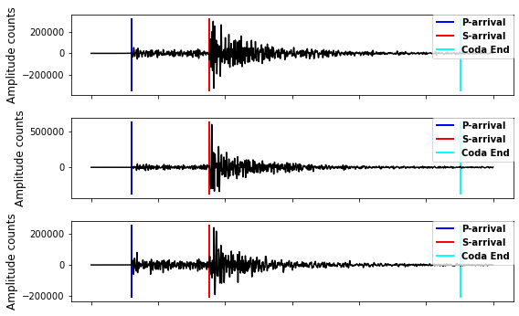

#  STEAD                                                                                                                                                                                                                                                             
------------------------------------------------------
See the notebook for the dataset's property                                                                            
------------------------------------------------------

You can get the dataset from here:                             

https://dl.orangedox.com/1bYQw9n6cOBeXPSkxv        

# How to access earthquake samples

    import h5py
    import matplotlib.pyplot as plt
    hdf_f = "STEAD.hdf5"
    r = h5py.File(hdf_f, 'r')

    for n in r:
        print('class: ', n)
        for nn in r[n]:
            print('category: ', nn)

class:  earthquake  
category:  local   
class:  non_earthquake   
category:  noise   

----------

    inpt =  r['earthquake']['local']
    for evi in inpt:
        print(str(evi))
        x = inpt[evi]

        fig = plt.figure()
        ax = fig.add_subplot(311)         
        plt.plot(x[:,0], 'k')
        plt.rcParams["figure.figsize"] = (8, 5)
        legend_properties = {'weight':'bold'}    
        plt.tight_layout()

        if x.attrs['trace_category'] == 'earthquake_local':    
            ymin, ymax = ax.get_ylim()
            pl = plt.vlines(x.attrs['p_arrival_sample'], ymin, ymax, color='b', linewidth=2, label='P-arrival')
            sl = plt.vlines(x.attrs['s_arrival_sample'], ymin, ymax, color='r', linewidth=2, label='S-arrival')
            cl = plt.vlines(x.attrs['coda_end_sample'], ymin, ymax, color='aqua', linewidth=2, label='Coda End')
            plt.legend(handles=[pl, sl, cl], loc = 'upper right', borderaxespad=0., prop=legend_properties)        
        plt.ylabel('Amplitude counts', fontsize=12) 
        ax.set_xticklabels([])

        ax = fig.add_subplot(312)         
        plt.plot(x[:,1], 'k')
        plt.rcParams["figure.figsize"] = (8, 5)
        legend_properties = {'weight':'bold'}    
        plt.tight_layout()

        if x.attrs['trace_category'] == 'earthquake_local':    
            ymin, ymax = ax.get_ylim()
            pl = plt.vlines(x.attrs['p_arrival_sample'], ymin, ymax, color='b', linewidth=2, label='P-arrival')
            sl = plt.vlines(x.attrs['s_arrival_sample'], ymin, ymax, color='r', linewidth=2, label='S-arrival')
            cl = plt.vlines(x.attrs['coda_end_sample'], ymin, ymax, color='aqua', linewidth=2, label='Coda End')
            plt.legend(handles=[pl, sl, cl], loc = 'upper right', borderaxespad=0., prop=legend_properties)        
        plt.ylabel('Amplitude counts', fontsize=12) 
        ax.set_xticklabels([])

        ax = fig.add_subplot(313)         
        plt.plot(x[:,2], 'k')
        plt.rcParams["figure.figsize"] = (8,5)
        legend_properties = {'weight':'bold'}    
        plt.tight_layout()

        if x.attrs['trace_category'] == 'earthquake_local':    
            ymin, ymax = ax.get_ylim()
            pl = plt.vlines(x.attrs['p_arrival_sample'], ymin, ymax, color='b', linewidth=2, label='P-arrival')
            sl = plt.vlines(x.attrs['s_arrival_sample'], ymin, ymax, color='r', linewidth=2, label='S-arrival')
            cl = plt.vlines(x.attrs['coda_end_sample'], ymin, ymax, color='aqua', linewidth=2, label='Coda End')
            plt.legend(handles=[pl, sl, cl], loc = 'upper right', borderaxespad=0., prop=legend_properties)        
        plt.ylabel('Amplitude counts', fontsize=12) 
        ax.set_xticklabels([])

        plt.show() 

        for at in x.attrs:
            print(at, x.attrs[at])    

For noise samples:

    inpt =  r['non_earthquake']['noise'] 
 
