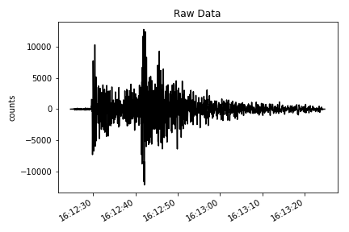
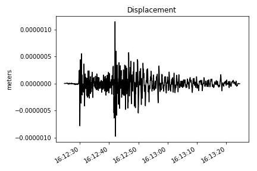
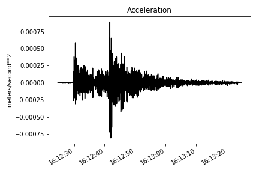

#  STanford EArthquake Dataset (STEAD):A Global Data Set of Seismic Signals for AI                                                                                   

 


-----------------------------------------


-----------------------------------------                                                                                                                                                                                   
### You can get the wavefoms from here: 

##### Each of the following files contains one hdf5 (data) and one CSV (metadata) files for ~ 200k 3C waveforms. You can download the chunks you need and then merge them into a single file using the provided code in the repository.

https://rebrand.ly/chunk1  (chunk1 ~ 14.6 GB) Noise

https://rebrand.ly/chunk2  (chunk2 ~ 13.7 GB) Local Earthquakes

https://rebrand.ly/chunk3  (chunk3 ~ 13.7 GB) Local Earthquakes

https://rebrand.ly/chunk4  (chunk4 ~ 13.7 GB) Local Earthquakes

https://rebrand.ly/chunk5  (chunk5 ~ 13.7 GB) Local Earthquakes

https://rebrand.ly/chunk6  (chunk6 ~ 15.7 GB) Local Earthquakes 

##### If you have a fast internet you can download the entire dataset in a single file from here:

https://rebrand.ly/whole (merged ~ 85 GB) Local Earthquakes + Noise

* Note1: some of the unzipper programs for Windows and Linux operating systems have size limits. Try '7Zip' software if had problems unzipping the files. 

* Note2: all the metadata are also available in the hdf5 file (as attributes associated with each waveform).

* Note3: For some of the noise data waveforms are identical for 3 components. These are related to single-channel stations where we duplicated the vertical channel for horizontal ones. However, these makeup to less than 4 % of noise data. For the rest, noise is different for each channel.

### You can get the paper from here:
https://www.researchgate.net/publication/336598670_STanford_EArthquake_Dataset_STEAD_A_Global_Data_Set_of_Seismic_Signals_for_AI

or

https://ieeexplore.ieee.org/abstract/document/8871127

### You can send your questions or suggestions to: 
mmousavi@stanford.edu

### Last Update:
May 25, 2020 

-------------------------------------
Reference:

`Mousavi, S. M., Sheng, Y., Zhu, W., Beroza G.C., (2019). 
STanford EArthquake Dataset (STEAD): A Global Data Set of Seismic Signals for AI, 
IEEE Access, doi:10.1109/ACCESS.2019.2947848` 


BibTeX:

    @article{mousavi2019stanford,
      title={STanford EArthquake Dataset (STEAD): A Global Data Set of Seismic Signals for AI},
      author={Mousavi, S Mostafa and Sheng, Yixiao and Zhu, Weiqiang and Beroza, Gregory C},
      journal={IEEE Access},
      year={2019},
      publisher={IEEE}
    }

-------------------------------------

The CSV file can be used to easily select a specific part of the dataset and only read associated waveforms from the hdf5 file for efficiency.

### Example of data selection and accessing (earthquake waveforms):

```python
import pandas as pd
import h5py
import numpy as np
import matplotlib.pyplot as plt

file_name = "merge.hdf5"
csv_file = "merge.csv"

# reading the csv file into a dataframe:
df = pd.read_csv(csv_file)
print(f'total events in csv file: {len(df)}')
# filterering the dataframe
df = df[(df.trace_category == 'earthquake_local') & (df.source_distance_km <= 20) & (df.source_magnitude > 3)]
print(f'total events selected: {len(df)}')

# making a list of trace names for the selected data
ev_list = df['trace_name'].to_list()

# retrieving selected waveforms from the hdf5 file: 
dtfl = h5py.File(file_name, 'r')
for c, evi in enumerate(ev_list):
    dataset = dtfl.get('data/'+str(evi)) 
    # waveforms, 3 channels: first row: E channle, second row: N channel, third row: Z channel 
    data = np.array(dataset)

    fig = plt.figure()
    ax = fig.add_subplot(311)         
    plt.plot(data[:,0], 'k')
    plt.rcParams["figure.figsize"] = (8, 5)
    legend_properties = {'weight':'bold'}    
    plt.tight_layout()
    ymin, ymax = ax.get_ylim()
    pl = plt.vlines(dataset.attrs['p_arrival_sample'], ymin, ymax, color='b', linewidth=2, label='P-arrival')
    sl = plt.vlines(dataset.attrs['s_arrival_sample'], ymin, ymax, color='r', linewidth=2, label='S-arrival')
    cl = plt.vlines(dataset.attrs['coda_end_sample'], ymin, ymax, color='aqua', linewidth=2, label='Coda End')
    plt.legend(handles=[pl, sl, cl], loc = 'upper right', borderaxespad=0., prop=legend_properties)        
    plt.ylabel('Amplitude counts', fontsize=12) 
    ax.set_xticklabels([])

    ax = fig.add_subplot(312)         
    plt.plot(data[:,1], 'k')
    plt.rcParams["figure.figsize"] = (8, 5)
    legend_properties = {'weight':'bold'}    
    plt.tight_layout()
    ymin, ymax = ax.get_ylim()
    pl = plt.vlines(dataset.attrs['p_arrival_sample'], ymin, ymax, color='b', linewidth=2, label='P-arrival')
    sl = plt.vlines(dataset.attrs['s_arrival_sample'], ymin, ymax, color='r', linewidth=2, label='S-arrival')
    cl = plt.vlines(dataset.attrs['coda_end_sample'], ymin, ymax, color='aqua', linewidth=2, label='Coda End')
    plt.legend(handles=[pl, sl, cl], loc = 'upper right', borderaxespad=0., prop=legend_properties)        
    plt.ylabel('Amplitude counts', fontsize=12) 
    ax.set_xticklabels([])

    ax = fig.add_subplot(313)         
    plt.plot(data[:,2], 'k')
    plt.rcParams["figure.figsize"] = (8,5)
    legend_properties = {'weight':'bold'}    
    plt.tight_layout()
    ymin, ymax = ax.get_ylim()
    pl = plt.vlines(dataset.attrs['p_arrival_sample'], ymin, ymax, color='b', linewidth=2, label='P-arrival')
    sl = plt.vlines(dataset.attrs['s_arrival_sample'], ymin, ymax, color='r', linewidth=2, label='S-arrival')
    cl = plt.vlines(dataset.attrs['coda_end_sample'], ymin, ymax, color='aqua', linewidth=2, label='Coda End')
    plt.legend(handles=[pl, sl, cl], loc = 'upper right', borderaxespad=0., prop=legend_properties)        
    plt.ylabel('Amplitude counts', fontsize=12) 
    ax.set_xticklabels([])
    plt.show() 

    for at in dataset.attrs:
        print(at, dataset.attrs[at])    

    inp = input("Press a key to plot the next waveform!")
    if inp == "r":
        continue             
```


-----------------------------------------                                                                                                                                                                                   

### Example of data selection and accessing (noise waveforms):

```python
# reading the csv file into a dataframe:
df = pd.read_csv(csv_file)
print(f'total events in csv file: {len(df)}')
# filterering the dataframe
df = df[(df.trace_category == 'noise') & (df.receiver_code == 'PHOB') ]
print(f'total events selected: {len(df)}')

# making a list of trace names for the selected data
ev_list = df['trace_name'].to_list()[:200]

# retrieving selected waveforms from the hdf5 file: 
dtfl = h5py.File(file_name, 'r')
for c, evi in enumerate(ev_list):
    dataset = dtfl.get('data/'+str(evi)) 
    # waveforms, 3 channels: first row: E channle, second row: N channel, third row: Z channel 
    data = np.array(dataset)

    fig = plt.figure()
    ax = fig.add_subplot(311)         
    plt.plot(data[:,0], 'k')
    plt.rcParams["figure.figsize"] = (8, 5)
    legend_properties = {'weight':'bold'}    
    plt.tight_layout()
    plt.ylabel('Amplitude counts', fontsize=12) 
    ax.set_xticklabels([])

    ax = fig.add_subplot(312)         
    plt.plot(data[:,1], 'k')
    plt.rcParams["figure.figsize"] = (8, 5)
    legend_properties = {'weight':'bold'}    
    plt.tight_layout()     
    plt.ylabel('Amplitude counts', fontsize=12) 
    ax.set_xticklabels([])

    ax = fig.add_subplot(313)         
    plt.plot(data[:,2], 'k')
    plt.rcParams["figure.figsize"] = (8,5)
    legend_properties = {'weight':'bold'}    
    plt.tight_layout()     
    plt.ylabel('Amplitude counts', fontsize=12) 
    ax.set_xticklabels([])
    plt.show() 

    for at in dataset.attrs:
        print(at, dataset.attrs[at])    

    inp = input("Press a key to plot the next waveform!")
    if inp == "r":
        continue       
```


-----------------------------------------                                                                                    

### How to convert raw waveforms into Acceleration, Velocity, or Displacement:

```python
import obspy
import h5py
from obspy import UTCDateTime
import numpy as np
from obspy.clients.fdsn.client import Client
import matplotlib.pyplot as plt

def make_stream(dataset):
    '''
    input: hdf5 dataset
    output: obspy stream

    '''
    data = np.array(dataset)

    tr_E = obspy.Trace(data=data[:, 0])
    tr_E.stats.starttime = UTCDateTime(dataset.attrs['trace_start_time'])
    tr_E.stats.delta = 0.01
    tr_E.stats.channel = dataset.attrs['receiver_type']+'E'
    tr_E.stats.station = dataset.attrs['receiver_code']
    tr_E.stats.network = dataset.attrs['network_code']

    tr_N = obspy.Trace(data=data[:, 1])
    tr_N.stats.starttime = UTCDateTime(dataset.attrs['trace_start_time'])
    tr_N.stats.delta = 0.01
    tr_N.stats.channel = dataset.attrs['receiver_type']+'N'
    tr_N.stats.station = dataset.attrs['receiver_code']
    tr_N.stats.network = dataset.attrs['network_code']

    tr_Z = obspy.Trace(data=data[:, 2])
    tr_Z.stats.starttime = UTCDateTime(dataset.attrs['trace_start_time'])
    tr_Z.stats.delta = 0.01
    tr_Z.stats.channel = dataset.attrs['receiver_type']+'Z'
    tr_Z.stats.station = dataset.attrs['receiver_code']
    tr_Z.stats.network = dataset.attrs['network_code']

    stream = obspy.Stream([tr_E, tr_N, tr_Z])

    return stream

# reading one sample trace from STEAD
dtfl = h5py.File(file_name, 'r')
dataset = dtfl.get('data/109C.TA_20061103161223_EV') 

# convering hdf5 dataset into obspy sream
st = make_stream(dataset)
# ploting the verical component of the raw data
tr_Z = st[2]
fig = plt.figure()
ax = fig.add_subplot(1, 1, 1)
ax.plot(tr_Z.times("matplotlib"), tr_Z.data, "k-")
ax.xaxis_date()
fig.autofmt_xdate()
plt.ylabel('counts')
plt.title('Raw Data')
plt.show()
```



```python
# downloading the instrument response of the station from IRIS
client = Client("IRIS")
inventory = client.get_stations(network=dataset.attrs['network_code'],
                                station=dataset.attrs['receiver_code'],
                                starttime=UTCDateTime(dataset.attrs['trace_start_time']),
                                endtime=UTCDateTime(dataset.attrs['trace_start_time']) + 60,
                                loc="*", 
                                channel="*",
                                level="response")  

# converting into displacement
st = make_stream(dataset)
st = st.remove_response(inventory=inventory, output="DISP", plot=False)
tr_Z = st[2]
fig = plt.figure()
ax = fig.add_subplot(1, 1, 1)
ax.plot(tr_Z.times("matplotlib"), tr_Z.data, "k-")
ax.xaxis_date()
fig.autofmt_xdate()
plt.ylabel('meters')
plt.title('Displacement')
plt.show()
```



```python
# converting into velocity
st = make_stream(dataset)
st = st.remove_response(inventory=inventory, output='VEL', plot=False) 
tr_Z = st[2]
fig = plt.figure()
ax = fig.add_subplot(1, 1, 1)
ax.plot(tr_Z.times("matplotlib"), tr_Z.data, "k-")
ax.xaxis_date()
fig.autofmt_xdate()
plt.ylabel('meters/second')
plt.title('Velocity')
plt.show()
```
        


```python
# converting into acceleration
st = make_stream(dataset)
st.remove_response(inventory=inventory, output="ACC", plot=False) 
tr_Z = st[2]
fig = plt.figure()
ax = fig.add_subplot(1, 1, 1)
ax.plot(tr_Z.times("matplotlib"), tr_Z.data, "k-")
ax.xaxis_date()
fig.autofmt_xdate()
plt.ylabel('meters/second**2')
plt.title('Acceleration')
plt.show()
```




